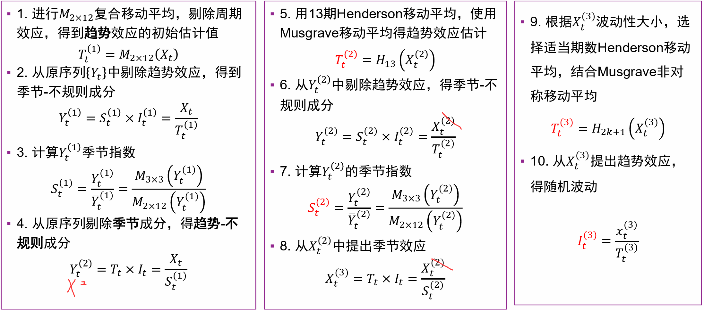

# Report

## Part 1. Decomposition

**前置**：对于本次分解任务，与上一次的分解不同，这次分解主要是分解为趋势项、季节项和剩余项；由于之前实现的分解方式为加性分解，即满足：$Y=T+S+R$，而非乘性分解$Y=TSR$，因此此处实现的STL和X11也为加性分解，从而能够进行更公平的比较分析。

### 1.1 STL Decomposition

**STL分解**：即Seasonal-trend decomposition using LOWESS，该方法使用LOWESS做局部加权回归，使序列平滑化，获得趋势项。在获得趋势项后，对去趋势项以季节周期为步长取平均值，将该平均值作为对应位置的季节项。然后再对此进行多次迭代，获得最终的分解结果。该种分解已在上次作业中实现过，此处不再赘述。

**实现细节**：本次实现对上次的实现方式做了更改。上次实现使用statsmodels库的lowess函数来做局部加权回归作为趋势项，再手动计算季节项和剩余项，并且没有进行迭代。本次实现直接使用statsmodels的STL方法。同样由于STL仅能处理1d的向量，因此实际分解时需要对所有的sample、所有的channel分别进行STL分解，效率相当低。

```python
X_trend = np.zeros_like(X)
X_season = np.zeros_like(X)
X_residual = np.zeros_like(X)
for i in range(X.shape[0]):
    for j in range(X.shape[2]):
        result = STL(X[i,:,j], period=seasonal_period, robust=True).fit()
        X_trend[i,:,j] = np.array(result.trend)
        X_season[i,:,j] = np.array(result.seasonal)
        X_residual[i,:,j] = np.array(result.resid)

return (X_trend, X_season, X_residual)
```

### 1.2 X11 Decomposition

**X11分解**：X11分解流程主要参考PPT讲义及[链接]([X-11 (jdemetradocumentation.github.io)](https://jdemetradocumentation.github.io/JDemetra-documentation/pages/theory/SA_X11.html))。该方法首先使用复合移动平均得到趋势项$T^1$，然后从原序列中剔除趋势项得到$deT^1$，由之计算得到季节项$S^1$，再从原序列剔除季节项得到$deS^1$，对之使用Henderson移动平均重新得到趋势项$T^2$（此处PPT中书写错误，$Y^2$和$X^2$书写混乱）。之后，重新使用该流程得到$deT^2,S^2,deS^2,T^3$，最后从去季节项中去除趋势项，得到剩余项$R$。（对于PPT中的乘性分解，去除指除法；对于实现中的加性分解，去除指减去）



需要注意的是，本次实现的X11分解为加性分解，从而和之前所实现的其他分解方法形成对照。此外，两个参考中均含有一些Magic Number，包括$M_{2\times 12}$移动平均、$Henderson_{13}$移动平均等，针对的是周期等于12(即月度数据)的情况。在本次实验中主要使用ETT数据集，其中周期等于24(即以小时为单位)，因此此处改为使用$M_{2\times 24}$移动平均、$Henderson_{23}$移动平均等。针对一些常用的$M_{3\times 3}$等，此处不做更改。

**实现细节**：针对$M_{2\times12}$这样的复合移动平均的实现方式，如同定义一样先后使用了两个移动平均$M_{12}$和$M_2$，此处借用此前实现的滑动平均分解函数。实现Henderson移动平均时，直接使用了其宽度为23的kernel，并使用scipy库的卷积函数实现加权的移动平均；由于卷积在边界会遇到值缺失问题，此处直接使用等效0填充。由于X11分解是支持并行化的，因此运行速度上比STL快很多，但比移动平均分解稍慢。

```python
# Step 01: Trend T1
T1 = moving_average(moving_average(X, seasonal_period)[0], 2)[0]
# Step 02: DeTrend DT1 (S,I)
DT1 = X - T1
# Step 03: Season S1
S1 = moving_average(moving_average(DT1, 3)[0], 3)[0] - moving_average(moving_average(DT1, seasonal_period)[0], 2)[0]
# Step 04: DeSeason DS1 (T,I)
DS1 = X - S1
# Step 05: Trend T2
Hw23 = np.array((-0.004, -0.011, -0.016, -0.015, -0.005, 0.013, 0.039, 0.068, 0.097, 0.122, 0.138, 0.148, 0.138, 0.122, 0.097, 0.068, 0.039, 0.013, -0.005, -0.015, -0.016, -0.011, -0.004))
Hw23 = np.expand_dims(np.expand_dims(Hw23, 0), 2)
T2 = sp.signal.convolve(DS1, np.flip(Hw23), 'same')
# Step 06: DeTrend DT2
DT2 = X - T2
# Step 07: Season S2
S2 = moving_average(moving_average(DT2, 3)[0], 3)[0] - moving_average(moving_average(DT2, seasonal_period)[0], 2)[0]
# Step 08: DeSeason DS2 (T,I)
DS2 = X - S2
# Step 09: Trend T3
T3 = sp.signal.convolve(DS2, np.flip(Hw23), 'same')
# Step 10: I
I = DS2 - T3
    
return (T3, S2, I)
```

## Part 2. Model

### 2.1 ARIMA

**修改距离度量**：同样是修改为针对多变量有效。

现在的距离度量输入可能有4种形状：(seq_len [,n_features]) (n_samples, seq_len [,n_features])。针对含有n_samples的情况，应当返回n_samples个标量值，代表每一个样本的距离度量；否则，返回一个标量作为距离度量。是否有n_features维度并不影响，只是作为距离计算时额外的数据罢了。

同样从兼容性出发，先将数据补齐n_samples(没有的视为1)，然后再将序列长度和特征维度统一成一个维度；对输入数据统一变形后，不需要修改度量本身计算便可得到正确的结果。

```python
def reshaping(a):
    if a.ndim <= 2:
        a = np.expand_dims(a, axis=0)
    return a.reshape(a.shape[0],-1)

dist(reshaping(A), reshaping(B))
```

### 2.2 ThetaMethod

**lag-based embedding**：即从当前时刻起，将此前共$m$个时刻、每个时刻间隔$\tau$的值，作为当前时刻的embedding，并以此embedding进行KNN中近邻的检索。可以表示为：
$$
y_n = (y_{n-(m-1)\tau},y_{n-(m-2)\tau},\cdots,y_{n-\tau},t_n)
$$
在原先的实现中，默认使用了$(y_{n-95}, \cdots,y_n)$来作为embedding，也即$m=96,\tau=1$。

由于在原先的TsfKNN框架中，训练数据不长于seq_len(96)，此处实现的embedding也只能利用seq_len范围以内的数据，无法完全实现该方法。项目中的实现方式如下：

```python
idx = np.arange(0, seq_len, tau)
if m > 0:
    idx = idx[:m]
return X[:,idx]
```

## Part 3. Residual Model

论文中实现的是PyTorch版本，并通过迭代来进行优化；本项目由于此前实现过Linear模型，于是基于Linear模型继续实现DLinear并求闭式解，并未使用PyTorch。后面会分析二者的不同。

**实现流程**：创建两个LinearRegression实例，分别负责趋势项和季节项的拟合。获取到训练数据时，先直接将数据分解为趋势项和季节项，并分别对趋势模型和季节模型进行训练；推理时，也需要对数据先分解，并分别得到趋势项和季节项的预测结果，再将二者结果相加即为最终预测结果。

**实现细节**：由于分解趋势项时，位于序列边缘处的数据通常会有更大的误差(无法同时获取此前和此后两侧的数据)，所以实现细节和处理顺序会对模型的表现效果有影响。实现的多个版本如下：

**版本0**：PyTorch版本，数据处理(即滑窗、分解等)的顺序任意，但不对标签Y进行分解，而是直接将预测趋势项和季节项的和以标签为目标联合优化，通过迭代的方式收敛。这样避免了人工显式对标签进行分解带来损失，而是隐式地联合优化，可能可以避免分解时带来的误差。但缺点在于实现复杂、迭代优化效率低。

**版本1**：先对序列进行分解，再用分解后的序列进行滑窗，然后分别求解模型。
这样处理的好处是位于边缘的元素最少，每一个元素均能获取较为准确的信息。同时，这样实现的方法也最简单，因为原本的Linear模型就是接收未滑窗的序列进行求解的。但这样的缺点就是不符合推理时的实际：推理的输入序列进行分解时，两端的元素是无法获取周围两侧的全部信息的；但求解时先分解再滑窗，使得滑窗边缘的元素实际上获取了周围两侧的信息，分布并不相同。

**版本2**：先对序列进行滑窗，再对滑窗后的序列进行分解，然后分别求解模型。
相比于版本1，该版本部分解决了滑窗边缘元素“视野”的问题，但仍然忽略了一点。求解所用的输入数据X和标签数据Y是在滑窗后划分的，如果先对滑窗后序列进行分解、在划分XY进行求解的话，X的末端和Y的首端也得到了“不应”看到的数据才进行分解，在分布上依旧有差异。

**版本3**：先对序列滑窗，然后划分XY，再分别对其进行分解，最后分别求解模型。
相较于前面两个版本，该版本尽量将求解时分布和推理时的分布做到统一。但缺点在于靠近分布的情况下，信息的利用率下降，对趋势项和季节项的分解不够精准。同时，由于对标签Y进行了分解，而该分解带来的误差也可能影响模型效果。

**版本4**：先对序列滑窗，然后划分XY，再只对X进行分解，求解趋势模型后，将趋势项的残差作为标签求解季节模型。
该版本的操作方式和思想都和前面的不大相同。该实现直接用X的趋势项去拟合标签Y，并将拟合结果作为趋势项的预测；残差即视为剩下的季节项，因此再用X的季节项对齐进行拟合。

通过一些简单的测试，可以发现多个版本的效果相差较小，在不同数据集上各有优劣。在权衡之下选择了实现版本3作为后续实验中的使用版本。

## Part 4. Evaluation

### 4.1 Temporal Embedding and Distance Combinations

该小节使用TsfKNN对不同的距离度量Distance和Lag-based embedding中的lag($\tau$)进行研究。对于参数$m$，此处选择使其取完96长度序列中的尽可能多的值，而不限制数量。这种方式会导致，对于固定的序列长度(96)，lag越小的情况下m越大。但如果固定序列长度m，则不同lag的视野就并不相同，越大的lag能获取越长远的信息。综合考虑，还是选择不限制序列长度m而保证相同的视野范围。

| Distance | Lag($\tau$) | MSE  | MAE  |
| :------- | :---------- | :--- | :--- |
|euclidean|1|13.59|2.06|
|         |2|13.06|2.03|
|         |3|13.24|2.03|
|         |4|13.42|2.05|
|         |5|**12.81**|**2.01**|
|**manhattan**|1|11.76|1.93|
|         |2|11.95|1.94|
|         |3|12.09|1.95|
|         |4|12.19|1.94|
|         |**5**|**11.76**|**1.92**|
|chebyshev|1|14.64|2.16|
|         |2|13.84|2.08|
|         |3|**12.77**|**2.04**|
|         |4|13.58|2.10|
|         |5|12.80|2.04|
|cosine   |1|57.07|4.10|
|         |2|52.81|3.97|
|         |3|**51.52**|3.95|
|         |4|52.02|**3.93**|
|         |5|52.62|3.98|

从上表可以得知，序列长度最长时(lag=1)，KNN并没有因为更多的信息取得更好的结果，反而结果是明显较差的。这可能是因为过于密集的序列引入了过多冗余，导致了对近邻的判断不正确。lag=5时是综合表现较好的，在较多情况下稍由于其他lag，这也说明了稀疏的重要性，不要引入冗余的数据。在几种距离度量中，曼哈顿距离是表现最好的，欧氏距离和切比雪夫距离表现相近，而余弦距离则表现远差于其他度量。

### 4.2 Decomposition Method Evaluation

该小节在标准化下使用不同的分解方法在不同的模型下进行测试。对于TsfKNN，若要使用分解后的趋势项和季节项作为输入，则需要仿照DLinear创建两个KNN，独立地记录趋势项和季节项的历史数据，并分别用于预测趋势项和季节项，最后将二者预测结果相加即为最终预测结果。

| Model | Decomposition | MSE  | MAE  |
| :------- | :---------- | :--- | :--- |
|TsfKNN|moving_average|**12.65**|**2.07**|
||differential|14.99|2.14|
||STL|23.12|2.65|
|DLinear|moving_average|**6.13**|**1.31**|
||differential|**6.13**|**1.31**|
||STL|6.86|1.36|

由上表可知，TsfKNN的总体效果明显弱于DLinear；在不进行分解时，KNN的结果也弱于Linear，算是意料之中。对三种分解方式，在DLinear上滑动平均和差分分解数值相近，但在TsfKNN上滑动平均更胜一筹。而STL作为三者中计算最慢的算法，表现结果反而也是最差的。一方面来说，本次的STL实现缺少了迭代等细节，会降低其效果；另一方面，STL实际分解结果是包含剩余项的，实现中直接将剩余项加在了季节项上，也可能会导致效果的变差。


- LLM比LLL弱一点
- Residual比nResidual好一点点但不显著
- Individual在m1尤其好，m2好一点，但都在变长时落后；在h1h2会变弱；而且非常慢


